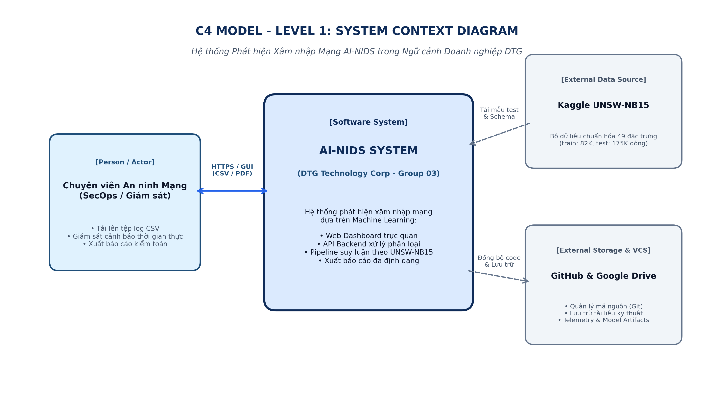
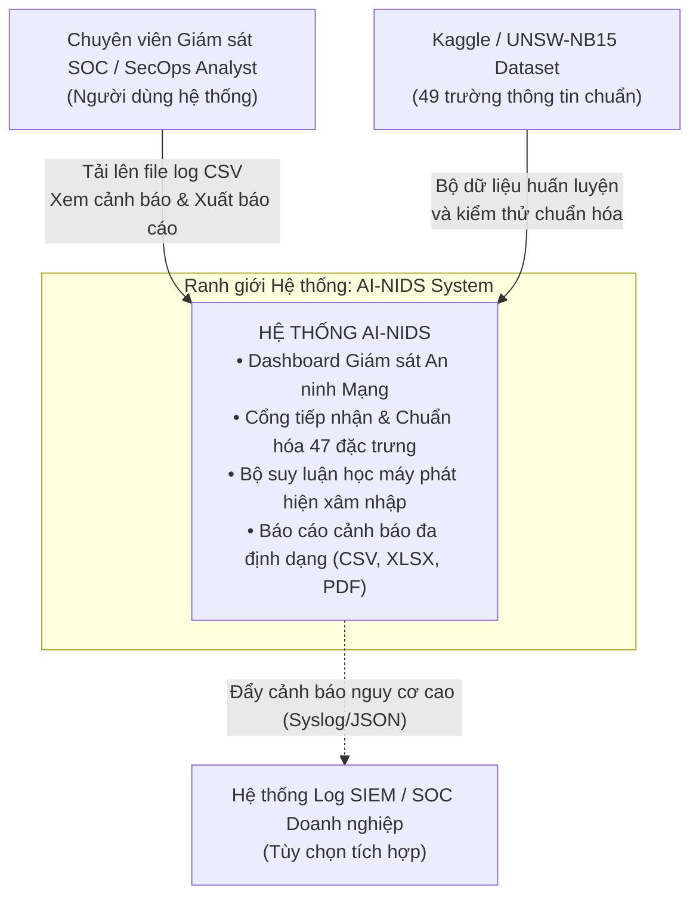
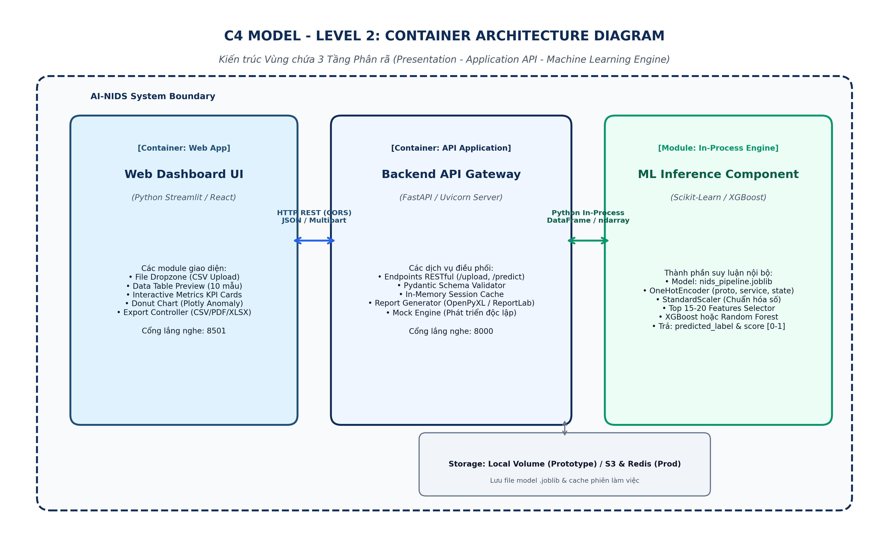
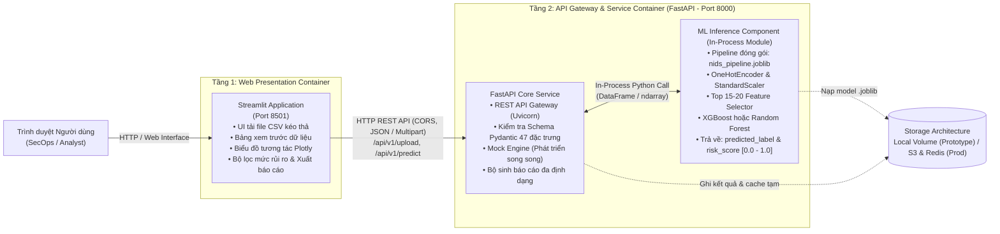
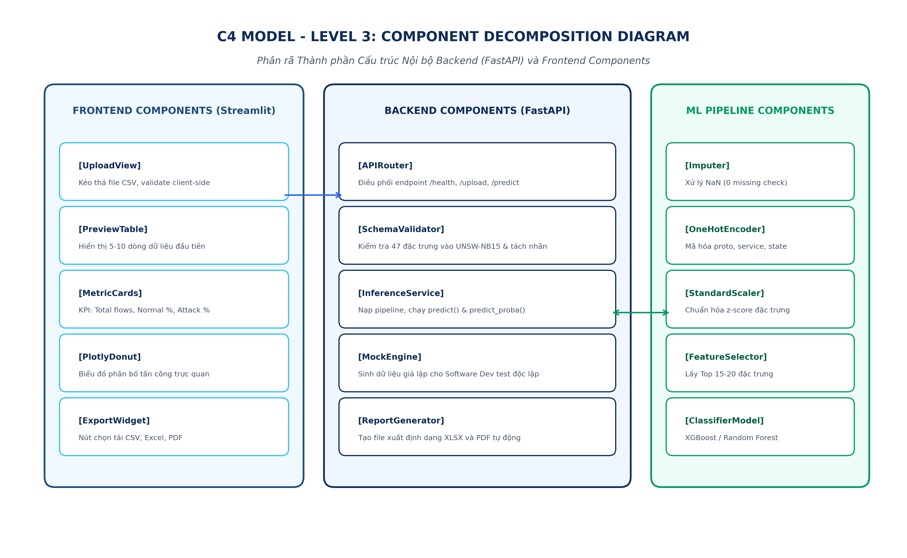
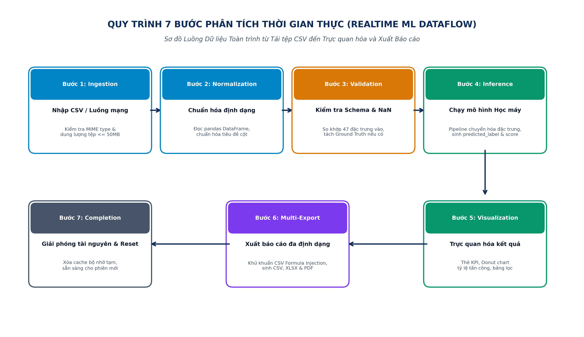
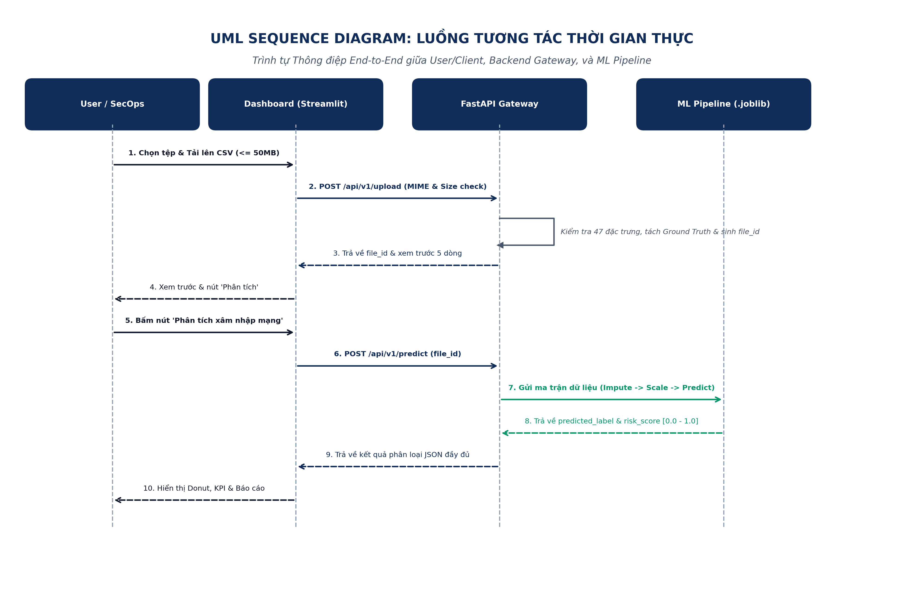
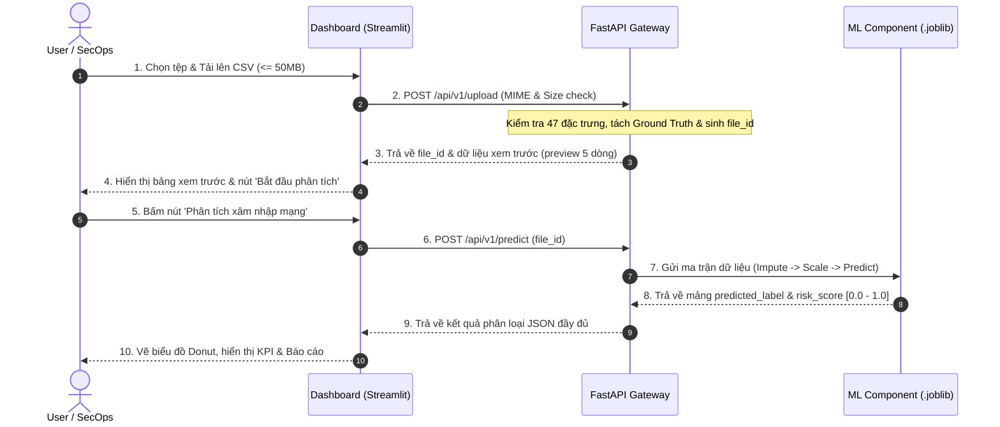
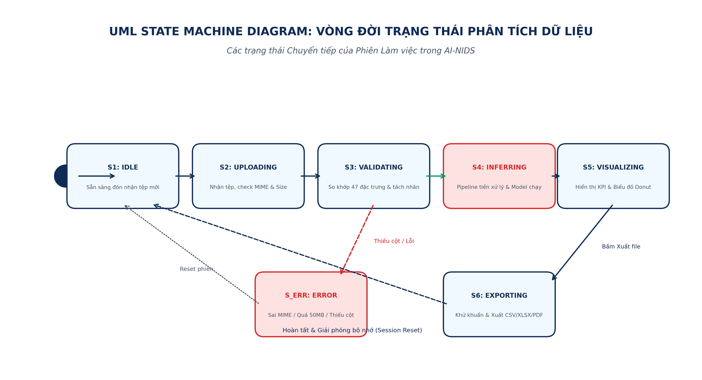
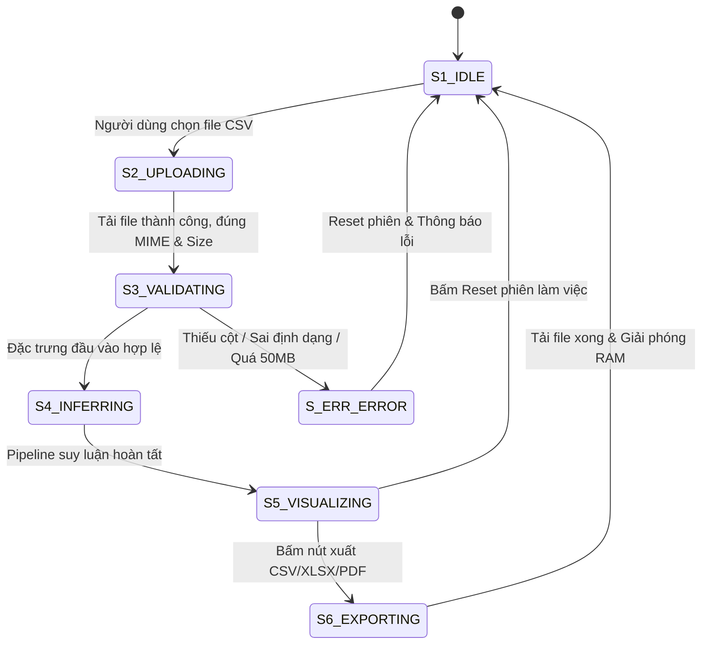

# TÀI LIỆU THIẾT KẾ HỆ THỐNG PHÁT HIỆN XÂM NHẬP MẠNG (AI-NIDS)
## SYSTEM DESIGN SPECIFICATION (IEEE 1016-2009 & C4 MODEL)

---

**Dự án:** Hệ thống Phát hiện Xâm nhập Mạng Ứng dụng Học máy Thời gian thực (AI-NIDS)  
**Tiêu chuẩn áp dụng:** IEEE 1016-2009 (Software Design Descriptions), ISO/IEC/IEEE 42010, C4 Model (Level 1–3), Arc42 for Machine Learning  
**Đơn vị thực hiện:** Nhóm 03 – Khóa thực tập Doanh nghiệp DTG 2026  
**Danh sách thành viên:**
- **Nguyễn Duy Thuận** – Kỹ thuật phần mềm (Trưởng nhóm - Kiến trúc Backend & Tích hợp)
- **Dương Hoàng Bảo Long** – Kỹ thuật phần mềm (Frontend, Trực quan hóa & Xuất báo cáo)
- **Văn Đức Cường** – Trí tuệ nhân tạo (Mô hình Học máy & Đánh giá)
- **Trần Thị Thu Hiền** – Trí tuệ nhân tạo (Pipeline Tiền xử lý & Kiểm thử)
- **Trần Ngọc Hải** – Khoa học dữ liệu (Phân tích Dữ liệu & Kỹ thuật đặc trưng)  

**Cán bộ hướng dẫn (DTG):** Anh Nguyễn Văn Hải | Anh Nguyễn Minh Huy  
**Bộ dữ liệu chuẩn hóa:** UNSW-NB15 Dataset (Kaggle: dhoogla/unswnb15, 49 trường thông tin: 47 features + 2 ground truth)  
**Kho mã nguồn (GitHub):** https://github.com/VNDT1625/DTG_ProjectGroup3  
**Kho tài liệu & Dữ liệu (Drive):** https://drive.google.com/drive/u/0/folders/1HlrreFLtmLEWQMcGSaUQbU43mdl77MT6  
**Phiên bản tài liệu:** 2.2 (Tháng 09/2026 - Bản hoàn thiện xuất bản chính thức)  
**Trạng thái:** Approved / Official Baseline  

---

## MỤC LỤC
1. [GIỚI THIỆU VÀ TỔNG QUAN HỆ THỐNG](#1-giới-thiệu-và-tổng-quan-hệ-thống)
2. [KHUNG TIÊU CHUẨN KIẾN TRÚC ÁP DỤNG](#2-khung-tiêu-chuẩn-kiến-trúc-áp-dụng)
3. [C4 MODEL - LEVEL 1: SYSTEM CONTEXT DIAGRAM](#3-c4-model---level-1-system-context-diagram)
4. [C4 MODEL - LEVEL 2: CONTAINER ARCHITECTURE DIAGRAM](#4-c4-model---level-2-container-architecture-diagram)
5. [C4 MODEL - LEVEL 3: COMPONENT DECOMPOSITION DIAGRAM](#5-c4-model---level-3-component-decomposition-diagram)
6. [QUY TRÌNH LUỒNG DỮ LIỆU TOÀN TRÌNH 7 BƯỚC (REALTIME ML DATAFLOW)](#6-quy-trình-luồng-dữ-liệu-toàn-trình-7-bước-realtime-ml-dataflow)
7. [UML DYNAMIC INTERACTION & SEQUENCE DIAGRAM](#7-uml-dynamic-interaction--sequence-diagram)
8. [UML STATE MACHINE DIAGRAM](#8-uml-state-machine-diagram)
9. [ĐẶC TẢ GIAO DIỆN VÀ HỢP ĐỒNG DỮ LIỆU (DATA CONTRACTS & REST API)](#9-đặc-tả-giao-diện-và-hợp-đồng-dữ-liệu-data-contracts--rest-api)
10. [KIẾN TRÚC TRIỂN KHAI, BẢO MẬT, PHI CHỨC NĂNG (NFR) VÀ KẾ HOẠCH BÀN GIAO](#10-kiến-trúc-triển-khai-bảo-mật-phi-chức-năng-nfr-và-kế-hoạch-bàn-giao)

---

## 1. GIỚI THIỆU VÀ TỔNG QUAN HỆ THỐNG

### 1.1. Bối cảnh dự án
Trong hạ tầng an ninh mạng hiện đại, các cuộc tấn công mạng diễn ra với tần suất ngày càng gia tăng, biến thiên phức tạp về kỹ thuật (như DoS, Fuzzers, Backdoor, Exploit, Generic, Reconnaissance) đe dọa trực tiếp an toàn thông tin và tính toàn vẹn dữ liệu của doanh nghiệp. Các hệ thống phát hiện xâm nhập truyền thống dựa trên dấu hiệu tĩnh (signature-based) bộc lộ hạn chế cố hữu khi hoàn toàn bất lực trước các nguy cơ tấn công mới chưa từng ghi nhận (Zero-Day).

Dự án **AI-NIDS (Artificial Intelligence - Network Intrusion Detection System)** được xây dựng nhằm cung cấp giải pháp phân tích và cảnh báo xâm nhập mạng thời gian thực, áp dụng các thuật toán học máy (Machine Learning) tiên tiến nhất trên tập dữ liệu chuẩn hóa UNSW-NB15, cung cấp cảnh báo trực quan cho chuyên viên vận hành an ninh (SOC/SecOps).

### 1.2. Mục tiêu kỹ thuật cốt lõi
Nhóm xác định rõ các chỉ tiêu kỹ thuật đóng vai trò là **ngưỡng mục tiêu định hướng (Target Objectives)** để đánh giá và tối ưu trong giai đoạn thực nghiệm; kết quả thực tế chi tiết sẽ được công bố sau khi hoàn tất kiểm thử chéo K-fold (K-fold Cross Validation) trên tập dữ liệu kiểm thử độc lập:
- **Recall (Tỷ lệ phát hiện tấn công / True Positive Rate):** Mục tiêu $\ge 96.5\%$ (Tiêu chí ưu tiên số một trong an ninh mạng nhằm giảm thiểu tối đa nguy cơ bỏ lọt cuộc xâm nhập, False Negative Rate $\le 3.5\%$).
- **Precision (Độ chuẩn xác cảnh báo):** Mục tiêu $\ge 94.0\%$ (Kiểm soát chặt chẽ tỷ lệ báo động giả trên lớp Normal, False Positive Rate $\le 5.0\%$, tránh làm quá tải chuyên viên SOC).
- **F1-Score (Macro / Weighted):** Mục tiêu $\ge 95.0\%$ (Đánh giá mức độ cân bằng hài hòa giữa Recall và Precision).
- **ROC-AUC & PR-AUC:** Mục tiêu $\ge 0.98$ (Đánh giá năng lực phân tách xác suất ranh giới nhị phân giữa luồng an toàn và luồng tấn công).
- **Accuracy (Độ chính xác nhị phân tổng thể):** Mục tiêu $\ge 95.0\%$.

### 1.3. Chuẩn đo lường hiệu năng và độ trễ (Latency Benchmark)
- **Pure Inference Latency (Độ trễ suy luận thuần túy qua Pipeline Scikit-Learn và mô hình XGBoost hoặc Random Forest):** $< 15\text{ms}$ cho luồng mạng đơn lẻ; $< 1.2\text{s}$ cho lô 10.000 bản ghi.
- **End-to-End Latency (Độ trễ toàn trình: Gồm truyền tải HTTP, Pydantic Schema Validation, Suy luận ML và Render JSON):** $< 50\text{ms}$ cho luồng đơn lẻ; $< 2.5\text{s}$ cho lô 10.000 bản ghi.
- **Cấu hình môi trường thử nghiệm tham chiếu (Benchmark Environment):** CPU Intel Core i5/i7 thế hệ 11+ hoặc AMD Ryzen 5/7 (4 Cores / 8 Threads), 16GB RAM DDR4, Windows 11 / Ubuntu 22.04 LTS, Python 3.10 / 3.11 x64, FastAPI Uvicorn Server, Scikit-Learn 1.3+, XGBoost 2.0+.

### 1.4. Quy định phạm vi của Mock Engine
Mock Engine là công cụ giả lập luồng dữ liệu ngẫu nhiên (Mock Traffic Generator), chỉ được sử dụng trong giai đoạn Sprint 1 phục vụ phát triển song song (Parallel Development) nhằm kiểm thử giao diện Frontend và xác thực luồng tích hợp API. **Mock Engine tuyệt đối không được sử dụng để đánh giá độ chính xác hay hiệu năng của mô hình AI-NIDS.**

---

## 2. KHUNG TIÊU CHUẨN KIẾN TRÚC ÁP DỤNG

Để đảm bảo chất lượng tài liệu kỹ thuật tương đương các dự án công nghệ cấp doanh nghiệp và quốc tế, bản thiết kế tuân thủ nghiêm ngặt hệ thống tiêu chuẩn:

1. **IEEE 1016-2009 (Standard for Information Technology - Systems Design - Software Design Descriptions):**
   - Quy định cấu trúc mô tả thiết kế đa góc nhìn (Design Views): Ngữ cảnh (Context View), Cấu trúc (Structural View), Tương tác động (Dynamic/Behavioral View), Giao tiếp (Interface View), Dữ liệu (Data View) và Triển khai (Deployment View).
2. **ISO/IEC/IEEE 42010 (Systems and software engineering - Architecture description):**
   - Đảm bảo tính nhất quán của các Viewpoints, Concerns, Stakeholders và Architecture Rationales.
3. **C4 Model (Context, Containers, Components, Code) của Simon Brown:**
   - Cung cấp phương pháp trực quan hóa kiến trúc phân cấp theo từng mức thu phóng (zoom levels), giúp các bên liên quan dễ dàng theo dõi từ bức tranh tổng quan đến chi tiết.
4. **Arc42 for Machine Learning (SE4ML - Software Engineering for ML):**
   - Chuẩn hóa quản lý vòng đời dữ liệu, Artifact đóng gói Pipeline (`.joblib`), Feature Engineering và giám sát độ trôi mô hình (Model Drift).

---

## 3. C4 MODEL - LEVEL 1: SYSTEM CONTEXT DIAGRAM

Sơ đồ ngữ cảnh cấp 1 mô tả ranh giới hệ thống AI-NIDS, các đối tượng tương tác trực tiếp (Người quản trị, Chuyên viên SOC, Kỹ sư ML) và các nguồn dữ liệu mạng ngoại vi.



### Sơ đồ Mermaid tương ứng:


---

## 4. C4 MODEL - LEVEL 2: CONTAINER ARCHITECTURE DIAGRAM

Sơ đồ Container cấp 2 phân rã hệ thống AI-NIDS thành các vùng chứa thực thi độc lập, làm rõ vị trí của tầng giao diện, tầng dịch vụ API và thành phần suy luận học máy:



### Sơ đồ Mermaid tương ứng:


---

## 5. C4 MODEL - LEVEL 3: COMPONENT DECOMPOSITION DIAGRAM

Sơ đồ Component cấp 3 đi sâu vào kiến trúc module nội bộ của từng Container, chỉ rõ trách nhiệm của từng thành phần phần mềm do các thành viên phụ trách.



### Bảng phân công trách nhiệm thành phần (Đồng bộ họ và tên đầy đủ):
| Thành phần | Thuộc Vùng chứa | Trách nhiệm chính | Thành viên phụ trách |
| :--- | :--- | :--- | :--- |
| **UploadView** | Streamlit Frontend | Tiếp nhận tệp CSV qua kéo-thả, kiểm tra kích thước file client-side và MIME type | Dương Hoàng Bảo Long |
| **PreviewTable** | Streamlit Frontend | Hiển thị 5–10 dòng đầu tiên giúp người dùng xác thực dữ liệu | Dương Hoàng Bảo Long |
| **MetricCards** | Streamlit Frontend | Hiển thị các chỉ số tổng hợp: Tổng số flow, Tỷ lệ Bình thường / Tấn công | Dương Hoàng Bảo Long |
| **PlotlyDonut** | Streamlit Frontend | Trực quan hóa tỷ lệ phần trăm phân bố nhãn lưu lượng truy cập | Dương Hoàng Bảo Long |
| **ExportWidget** | Streamlit Frontend | Tùy chọn định dạng và nút tải xuống kết quả (CSV, XLSX, PDF) | Dương Hoàng Bảo Long |
| **APIRouter** | FastAPI Backend | Định tuyến các endpoint `/health`, `/upload`, `/predict`, `/export` | Nguyễn Duy Thuận |
| **SchemaValidator** | FastAPI Backend | Xác thực 47 đặc trưng đầu vào UNSW-NB15 qua Pydantic Model và tách Ground Truth | Nguyễn Duy Thuận |
| **InferenceService**| FastAPI Backend | Điều phối nạp pipeline, xử lý dữ liệu và trả kết quả nhãn `predicted_label` + `risk_score` | Nguyễn Duy Thuận |
| **MockEngine** | FastAPI Backend | Sinh dữ liệu mô phỏng cho phép Frontend kiểm thử độc lập (Sprint 1) | Nguyễn Duy Thuận |
| **ReportGenerator**| FastAPI Backend | Xây dựng tệp báo cáo Excel định dạng chuyên nghiệp và PDF tóm tắt | Nguyễn Duy Thuận |
| **Imputer** | ML Component | Xử lý các giá trị khuyết thiếu (missing values) bằng median/constant | Trần Ngọc Hải |
| **OneHotEncoder** | ML Component | Mã hóa các trường phân loại (`proto`, `service`, `state`) | Trần Ngọc Hải |
| **StandardScaler** | ML Component | Chuẩn hóa thang đo các đặc trưng số thực (Z-Score scaling) | Trần Thị Thu Hiền |
| **FeatureSelector**| ML Component | Lựa chọn Top 15–20 đặc trưng có Importance/Information Gain cao nhất | Trần Thị Thu Hiền |
| **ClassifierModel**| ML Component | Thực thi thuật toán phân loại chính (XGBoost hoặc Random Forest) | Văn Đức Cường |

---

## 6. QUY TRÌNH LUỒNG DỮ LIỆU TOÀN TRÌNH 7 BƯỚC (REALTIME ML DATAFLOW)

Quy trình xử lý dữ liệu từ lúc tải tệp lên cho đến khi hoàn tất phiên làm việc được tiêu chuẩn hóa theo 7 bước nghiêm ngặt:



### Diễn giải chi tiết 7 bước:
1. **Bước 1 (Ingestion):** Người dùng kéo-thả tệp dữ liệu lưu lượng mạng (`.csv`) lên giao diện Web Streamlit. Hệ thống kiểm tra dung lượng ($\le 50\text{MB}$) và định dạng MIME (`text/csv`).
2. **Bước 2 (Normalization):** Dữ liệu được đưa vào bộ nhớ tạm thời dưới dạng Pandas DataFrame, chuẩn hóa tiêu đề cột và loại bỏ ký tự lạ.
3. **Bước 3 (Validation & Separation):** Thành phần Pydantic Validator kiểm tra sự hiện diện của các đặc trưng mạng đầu vào; tự động tách biệt 2 cột nhãn Ground Truth (`label`, `attack_cat`) nếu có để phục vụ đối chiếu đánh giá (hỗ trợ đầy đủ cả file thực tế không có nhãn).
4. **Bước 4 (Inference):** Dữ liệu hợp lệ được chuyển vào `nids_pipeline.joblib`. Pipeline tự động thực thi chuỗi: Imputation $\rightarrow$ One-Hot Encoding $\rightarrow$ Scaling $\rightarrow$ Feature Selection $\rightarrow$ XGBoost Predict. Mô hình sinh ra nhãn dự đoán `predicted_label` ($0$: Bình thường, $1$: Tấn công) cùng Điểm rủi ro `risk_score` (số thực trong đoạn $[0.0 - 1.0]$ biểu diễn xác suất $P(Y=1|X)$).
5. **Bước 5 (Visualization):** Kết quả dự đoán được đẩy về Frontend, tự động cập nhật các thẻ số liệu thống kê (KPIs), biểu đồ tròn Donut Plotly và bảng dữ liệu chi tiết kèm mã màu cảnh báo (Xanh: Low, Vàng: Medium, Đỏ: High).
6. **Bước 6 (Multi-Export):** Người dùng tùy chọn xuất kết quả:
   - **CSV / XLSX:** Chứa dữ liệu gốc kèm 3 cột bổ sung: `predicted_label`, `risk_score` (xác suất float) và `risk_level` (Low/Medium/High), kèm cột `ground_truth_label` nếu có. Dữ liệu được khử khuẩn chống CSV Formula Injection.
   - **PDF:** Bản tóm tắt tổng quan gồm biểu đồ phân bố và các dòng cảnh báo nguy cơ cao nhất.
7. **Bước 7 (Completion & Memory Reset):** Hệ thống dọn dẹp các đối tượng DataFrame và cache bộ nhớ tạm thời, đưa hệ thống về trạng thái sẵn sàng cho phiên tải tệp tiếp theo mà không gây rò rỉ bộ nhớ (memory leak).

---

## 7. UML DYNAMIC INTERACTION & SEQUENCE DIAGRAM

Sơ đồ trình tự UML mô tả chi tiết các thông điệp trao đổi qua lại giữa Người dùng, Dashboard Frontend, Backend Gateway và ML Inference Engine trong một phiên phân tích hoàn chỉnh.



### Sơ đồ Mermaid tương ứng:


---

## 8. UML STATE MACHINE DIAGRAM

Sơ đồ máy trạng thái biểu diễn toàn bộ các trạng thái có thể có của phiên phân tích lưu lượng mạng, cùng các điều kiện chuyển trạng thái (guards/triggers) và xử lý ngoại lệ an toàn.



### Sơ đồ Mermaid tương ứng:


---

## 9. ĐẶC TẢ GIAO DIỆN VÀ HỢP ĐỒNG DỮ LIỆU (DATA CONTRACTS & REST API)

### 9.1. Hợp đồng dữ liệu đầu vào (Input Data Contract - UNSW-NB15)
Bộ dữ liệu sử dụng trong dự án gồm 49 trường thông tin: 47 trường đầu vào theo schema, trong đó `id` chỉ dùng để định danh bản ghi và bị loại khỏi không gian đặc trưng của mô hình; cùng 2 trường Ground Truth là `label` và `attack_cat`.

Số đặc trưng mạng thực tế được nạp vào mô hình là 46, sau khi loại bỏ trường `id`.

#### A. Phân hệ Đặc trưng Đầu vào phục vụ Suy luận (Inference Input Features):
- **Trường định danh bản ghi (`id`):** Được giữ trong schema Pydantic để định danh từng dòng dữ liệu và liên kết kết quả hiển thị trên bảng điều khiển, nhưng **hoàn toàn bị loại bỏ khỏi không gian đặc trưng (Feature Space) của mô hình** nhằm triệt tiêu nguy cơ rò rỉ dữ liệu (Data Leakage).
- **46 Đặc trưng mạng thực tế:**
  - **Nhóm Giao thức & Định danh:** `srcip`, `sport`, `dstip`, `dsport`, `proto` (tcp, udp, ...), `state` (FIN, INT, CON, ...).
  - **Nhóm Dịch vụ & Thời gian:** `service` (http, ftp, dns, ssh, -), `dur` (duration), `sbytes`, `dbytes`, `sttl`, `dttl`.
  - **Nhóm Đo lường gói tin & Tải lưu lượng:** `spkts`, `dpkts`, `sload`, `dload`, `sloss`, `dloss`, `sinpkt`, `dinpkt`, `sjit`, `djit`.
  - **Nhóm Thuộc tính TCP nâng cao:** `swin`, `dwin`, `stcpb`, `dtcpb`, `tcprtt`, `synack`, `ackdat`.
  - **Nhóm Kết nối Cửa sổ Thời gian (Window Connection Features):** `ct_srv_src`, `ct_state_ttl`, `ct_dst_ltm`, `ct_src_dport_ltm`, `ct_dst_sport_ltm`, `ct_dst_src_ltm`.

#### B. Phân hệ 2 Trường Nhãn Ground Truth (Chỉ dùng Huấn luyện & Đánh giá Offline):
- `label`: Nhãn nhị phân ($0$: Bình thường, $1$: Tấn công).
- `attack_cat`: Nhãn phân loại đa lớp, gồm các nhóm tấn công được định nghĩa trong tập dữ liệu (như Fuzzers, Analysis, Backdoors, DoS, Exploits, Generic, Reconnaissance, Shellcode, Worms) và giá trị `Normal` đối với lưu lượng an toàn.
- **Quy tắc:** Khi thực hiện suy luận trực tiếp (Live Inference), hai cột này hoàn toàn bị tách ra khỏi dữ liệu nạp vào mô hình. Nếu tệp dữ liệu kiểm thử có sẵn 2 cột này, hệ thống sẽ tự động dùng làm Ground Truth đối chiếu để tính ma trận nhầm lẫn (Confusion Matrix).

### 9.2. Định nghĩa Quy chuẩn Điểm Rủi ro (Risk Score Definition)
- **Trong Backend REST API:** `risk_score` là số thực dấu phẩy động (float) trong đoạn $[0.0 - 1.0]$, biểu diễn xác suất có điều kiện $P(Y=1 | X)$ sinh ra từ phương thức `predict_proba()`.
- **Phân loại Cấp độ Rủi ro (Risk Level Classification):**
  - Mức Thấp (`Low`): $[0.0, 0.3)$ – Luồng lưu lượng mạng bình thường.
  - Mức Trung bình (`Medium`): $[0.3, 0.7)$ – Luồng nghi vấn, cảnh báo theo dõi.
  - Mức Cao (`High`): $[0.7, 1.0]$ – Luồng tấn công rõ rệt, kích hoạt cảnh báo đỏ.
- **Hiển thị trên Frontend (Presentation Layer):** Giao diện Streamlit chuyển đổi sang phần trăm: $\text{Risk Percentage} = \text{risk\_score} \times 100\%$ (Ví dụ: $0.942 \rightarrow 94.2\%$).

### 9.3. Đặc tả các REST API Endpoints của Backend (FastAPI)

#### Endpoint 1: Kiểm tra sức khỏe hệ thống
- **URL:** `GET /health`
- **Response mẫu:**
```json
{
  "status": "healthy",
  "version": "1.0.0",
  "model_loaded": true,
  "model_type": "XGBoostClassifier",
  "timestamp": "2026-09-18T21:00:00Z"
}
```

#### Endpoint 2: Tải lên và Xác thực Tệp dữ liệu
- **URL:** `POST /api/v1/upload`
- **Content-Type:** `multipart/form-data`
- **Request Body:** File `.csv`
- **Response mẫu:**
```json
{
  "file_id": "fl_sample_uuid4_2026",
  "filename": "unsw_sample_test.csv",
  "total_rows": 5000,
  "total_features": 47,
  "has_ground_truth": true,
  "validation_status": "PASSED",
  "preview_data": [
    {"id": 1, "proto": "tcp", "service": "http", "dur": 0.121, "sbytes": 452, "dbytes": 1024}
  ]
}
```

#### Endpoint 3: Thực thi Dự đoán Xâm nhập Mạng
- **URL:** `POST /api/v1/predict`
- **Content-Type:** `application/json`
- **Request Body:**
```json
{
  "file_id": "fl_sample_uuid4_2026",
  "threshold": 0.50
}
```
- **Response mẫu (Phân định rõ predicted_label và ground_truth_label):**
```json
{
  "file_id": "fl_sample_uuid4_2026",
  "pure_inference_time_ms": 38.2,
  "total_execution_time_ms": 115.4,
  "summary": {
    "total_flows": 5000,
    "normal_count": 4210,
    "attack_count": 790,
    "attack_percentage": 15.8
  },
  "predictions": [
    {
      "row_id": 1,
      "predicted_label": 0,
      "prediction": "Normal",
      "risk_score": 0.024,
      "risk_level": "Low",
      "ground_truth_label": 0
    },
    {
      "row_id": 2,
      "predicted_label": 1,
      "prediction": "Attack",
      "risk_score": 0.942,
      "risk_level": "High",
      "ground_truth_label": 1
    }
  ]
}
```

#### Endpoint 4: Xuất Báo cáo Tổng hợp
- **URL:** `POST /api/v1/export`
- **Content-Type:** `application/json`
- **Request Body:** `{"file_id": "fl_sample_uuid4_2026", "format": "xlsx"}`
- **Response:** Tải xuống file nhị phân (Binary Stream).

---

## 10. KIẾN TRÚC TRIỂN KHAI, BẢO MẬT, PHI CHỨC NĂNG (NFR) VÀ KẾ HOẠCH BÀN GIAO

### 10.1. Yêu cầu An ninh và Gia cố Hệ thống (Security & Hardening)
1. **Kiểm soát Tệp Tải lên (Upload Hardening):** Xác thực nghiêm ngặt MIME type (`text/csv`, `application/vnd.ms-excel`), kiểm tra phần mở rộng `.csv`, giới hạn kích thước tối đa $50\text{MB}$ hoặc tối đa $100.000$ dòng.
2. **Chống tấn công CSV Injection (Formula Injection):** Tự động khử khuẩn (sanitize) các ô dữ liệu bắt đầu bằng các ký tự nguy hiểm (`=`, `+`, `-`, `@`) trước khi ghi vào tệp CSV hoặc Excel XLSX xuất ra.
3. **Chống tấn công Path Traversal:** Mã hóa tên tệp lưu tạm bằng định danh ngẫu nhiên UUID v4 chuẩn (`fl_sample_uuid4_2026`), cách ly hoàn toàn tên tệp do người dùng tải lên.
4. **Bảo mật Cổng API:** Tích hợp CORS Middleware chỉ cho phép origin của Streamlit Frontend truy cập; áp dụng Rate Limiting chống tấn công brute-force hoặc DoS API.

### 10.2. Kiến trúc Lưu trữ: Prototype Hiện tại vs Định hướng Production
- **Giai đoạn Prototype / Thực tập hiện tại:** Sử dụng Local Volume Mount (`/artifacts` và `/data`) để đảm bảo hệ thống gọn nhẹ, dễ cài đặt và chạy mượt mà ngay trên laptop cá nhân của giảng viên, hội đồng phản biện và sinh viên mà không cần phụ thuộc cấu hình cloud phức tạp.
- **Lộ trình Mở rộng Production (Multi-replica / Horizontal Scaling):**
  - Thay thế local volume bằng Shared Object Storage (MinIO hoặc AWS S3) để phân phối Model Artifacts đồng bộ giữa các backend container.
  - Sử dụng Redis làm In-Memory Cache lưu trữ trạng thái phiên làm việc (Session State).
  - Các Backend Container FastAPI hoạt động hoàn toàn theo cơ chế Phi trạng thái (Stateless), sẵn sàng auto-scaling trên Kubernetes (K8s) hoặc Docker Swarm.

### 10.3. Yêu cầu Phi chức năng (Non-Functional Requirements - NFR)
1. **Hiệu năng:** RAM sử dụng khi nạp mô hình $\le 1.5\text{GB}$. Pure Inference Latency $< 15\text{ms}$/luồng, $< 1.2\text{s}$/10.000 dòng.
2. **Tính sẵn sàng và Tin cậy:** Kích hoạt Graceful Degradation thông qua Mock Engine khi mô hình ML bảo trì, đảm bảo giao diện không bị treo.
3. **Quản lý bộ nhớ:** Tự động giải phóng DataFrame và xóa cache phiên làm việc ngay khi xuất báo cáo xong hoặc sau $30\text{ phút}$ timeout.

### 10.4. Cấu trúc Kho Mã nguồn Dự án (GitHub Repository)
```text
DTG_ProjectGroup3/
├── backend/                  # Dịch vụ API Backend (FastAPI) - Nguyễn Duy Thuận
│   ├── app/
│   │   ├── api/              # Định tuyến endpoints: upload, predict, export
│   │   ├── core/             # Cấu hình CORS, RateLimit, Logging, Security
│   │   └── services/         # InferenceService, MockEngine, ReportGenerator
│   └── main.py               # Điểm khởi chạy máy chủ FastAPI
├── frontend/                 # Giao diện Giám sát (Streamlit) - Dương Hoàng Bảo Long
│   ├── app.py                # Dashboard chính: Kéo thả file, biểu đồ Plotly
│   └── components/           # UploadView, MetricCards, ReportDownloader
├── ml_pipeline/              # Động cơ Trí tuệ Nhân tạo - Cường, Hiền, Hải
│   ├── notebooks/            # Jupyter Notebooks: EDA, Feature Selection, Training
│   ├── src/                  # Mã nguồn Pipeline: Preprocessing & Evaluator
│   └── artifacts/            # nids_pipeline.joblib (Mô hình đóng gói)
├── data/                     # Tập dữ liệu mẫu UNSW-NB15 phục vụ thử nghiệm
├── tests/                    # Kịch bản kiểm thử tự động (Unit Test & Integration Test)
├── docs/                     # Tài liệu thiết kế kỹ thuật (IEEE 1016 & C4 Model)
├── DESIGN_DOCS.md            # Bản đặc tả kỹ thuật dạng Markdown
└── README.md                 # Hướng dẫn cài đặt và vận hành hệ thống
```

### 10.5. Lộ trình Triển khai và Bàn giao
- **Tuần 1 (Hiện tại):** Hoàn thành tài liệu thiết kế hệ thống chuẩn IEEE 1016, 6 sơ đồ C4/UML; xây dựng giao diện Dashboard cơ sở và Mock Data Engine.
- **Tuần 2:** Đội ML hoàn thành huấn luyện mô hình XGBoost hoặc Random Forest trên UNSW-NB15, xuất artifact `nids_pipeline.joblib`.
- **Tuần 3:** Tích hợp trực tiếp (End-to-End Integration) giữa Backend FastAPI và ML Pipeline thực tế; hoàn thiện tính năng xuất báo cáo XLSX/PDF.
- **Tuần 4:** Kiểm thử toàn diện (Unit Test, Integration Test, Load Test), tối ưu hóa giao diện và đóng gói Docker bàn giao DTG.

---
*Tài liệu được phê duyệt bởi Trưởng nhóm và lưu hành nội bộ nhóm dự án DTG AI-NIDS.*

